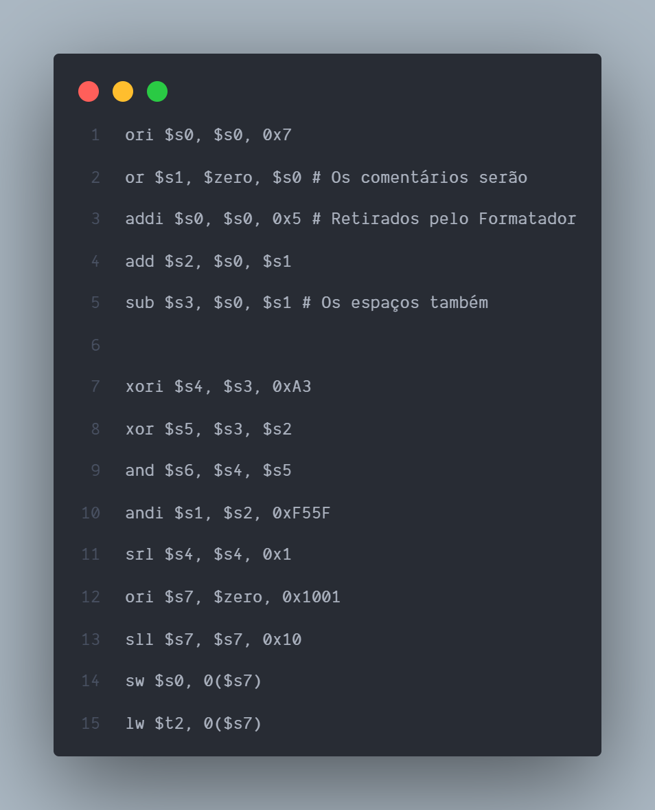
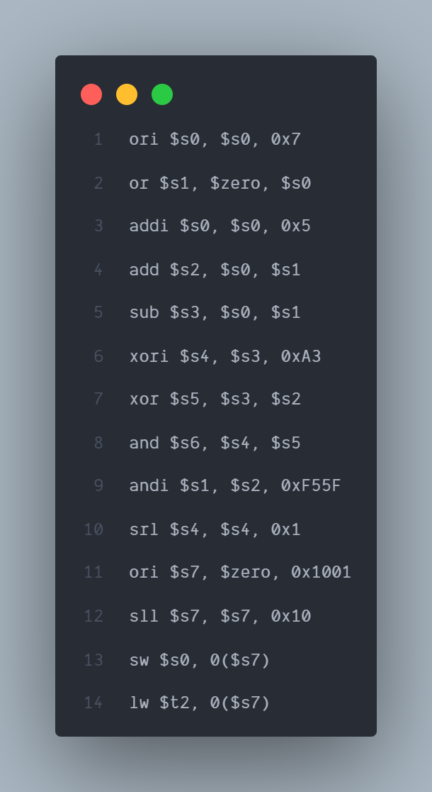
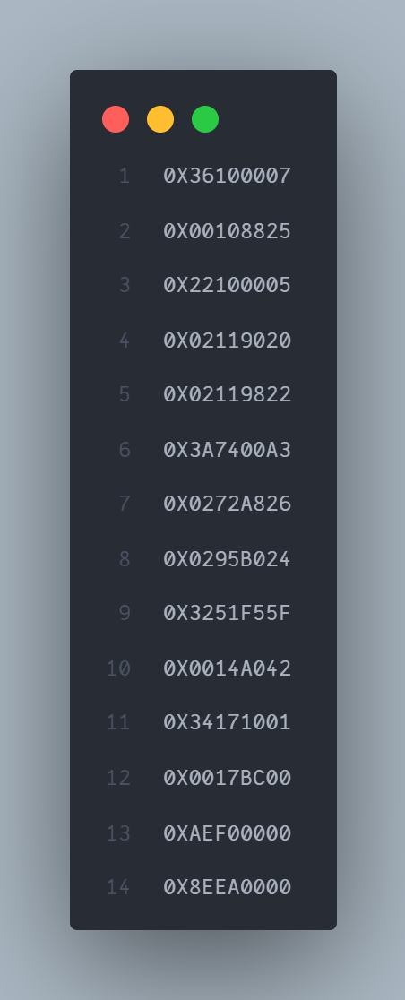

# TRABALHO DE ORGANIZAÇÃO DE COMPUTADORES

### Ler um arquivo de texto com código em Assembly MIPS e convertê-lo em Hexadecimal

---

 

 <a href="#Considerações">Considerações</a>&nbsp;&nbsp; | <a href="#Imagens">Imagens</a>&nbsp;&nbsp; | <a href="#Tutorial">Tutorial</a>

## Considerações:

1. No arquivo 'Convertendo para Hexa - Passo a Passo.txt' está todo o passo a passo para chegar no resultado hexadecimal de forma teórica
2. O arquivo 'cod.asm' contém o codigo base usado, o mesmo deve ser aberto através do MARS
3. A pasta 'Trabalho' deve ser importada na IDE em que o algoritmo será executado, para desenvolver o algoritmo, foi utilizado o Eclipse (última atualização disponível)
4. Na pasta 'Trabalho' existe o arquivo 'cod_asm.txt', contendo o código base em assembly MIPS, o mesmo será lido na execução do algoritmo
5. Ao final da execução, dentro da pasta 'Trabalho', será criado o arquivo 'cod_hexadecimal.txt' contendo o código em hexadecimal

---

## Tutorial

- jdk ^17 recomendada
- Como o algoritmo foi desenvolvido no Eclipse, recomenda-se que use a mesma IDE para manter o encode (Versões antigas podem gerar incompatibilidade).
- Para outra IDE, como VScode, é recomendado trocar o encode para windows 1252, CP1250 ou equivalente
- O passo a passo será com base no Eclipse
- Para executar o Algoritmo é preciso seguir os seguintes passos:

### ECLIPSE:

1. Descompactar o arquivo '.rar' enviado
2. Copiar a pasta 'Trabalho' e colar no destino onde os projetos do Eclipse ficam armazenados, normalmente essa pasta tem o nome de 'eclipse-workspace'
3. Abra a IDE
4. No menu de opções selecione: File -> Import
5. Após abrir o menu 'Import', selecione: General -> Existing Projects into Workspace
6. Aperte 'Next' e, em seguida, selecione o diretório padrão dos projetos do Eclipse em sua máquina apertando no botão 'browse'
7. Com o check-box selecionado, aperte em Finish
8. Com isso, o projeto foi carregado na IDE
9. As classes estão em Trabalho -> src -> (default package)
10. Basta executar a classe Main.

### VSCODE:

1. Descompactar o arquivo '.rar' enviado
2. File (arquivo) -> Open Folder... (Abrir Pasta...) -> selecione o diretório da pasta Trabalho, clique em abrir pasta
3. Executar com o F5

---

# Imagens

### Exemplo de códgio

### Código formatado (sem comentário e sem linhas vazias)

### Código final em HEX

